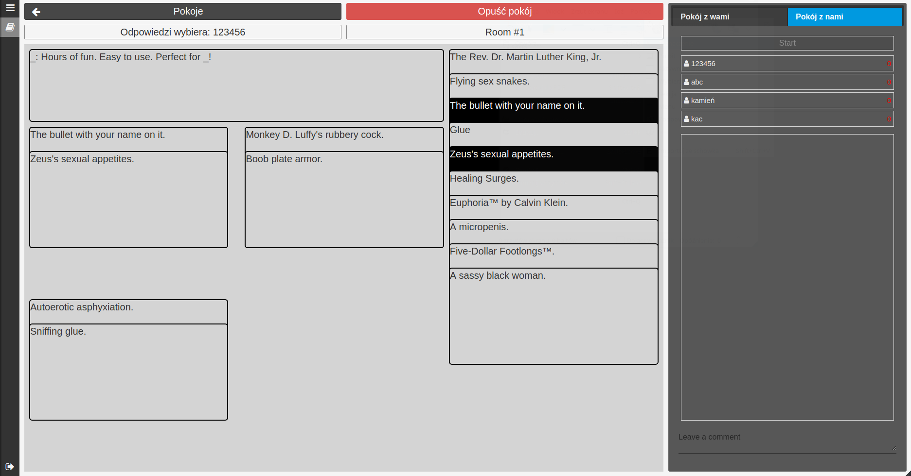

# DixappUi

This project was generated with [Angular CLI](https://github.com/angular/angular-cli) version 1.5.3.

## Development server

Run `ng serve` for a dev server. Navigate to `http://localhost:4200/`. The app will automatically reload if you change any of the source files.

## Project description

It's user interface for web service Dixapp - platform for playing board games online. For now there is only one game included - implementation of Cards Against Humanity.
It is the most basic version of game, because dixapp is still under development

## Screens

